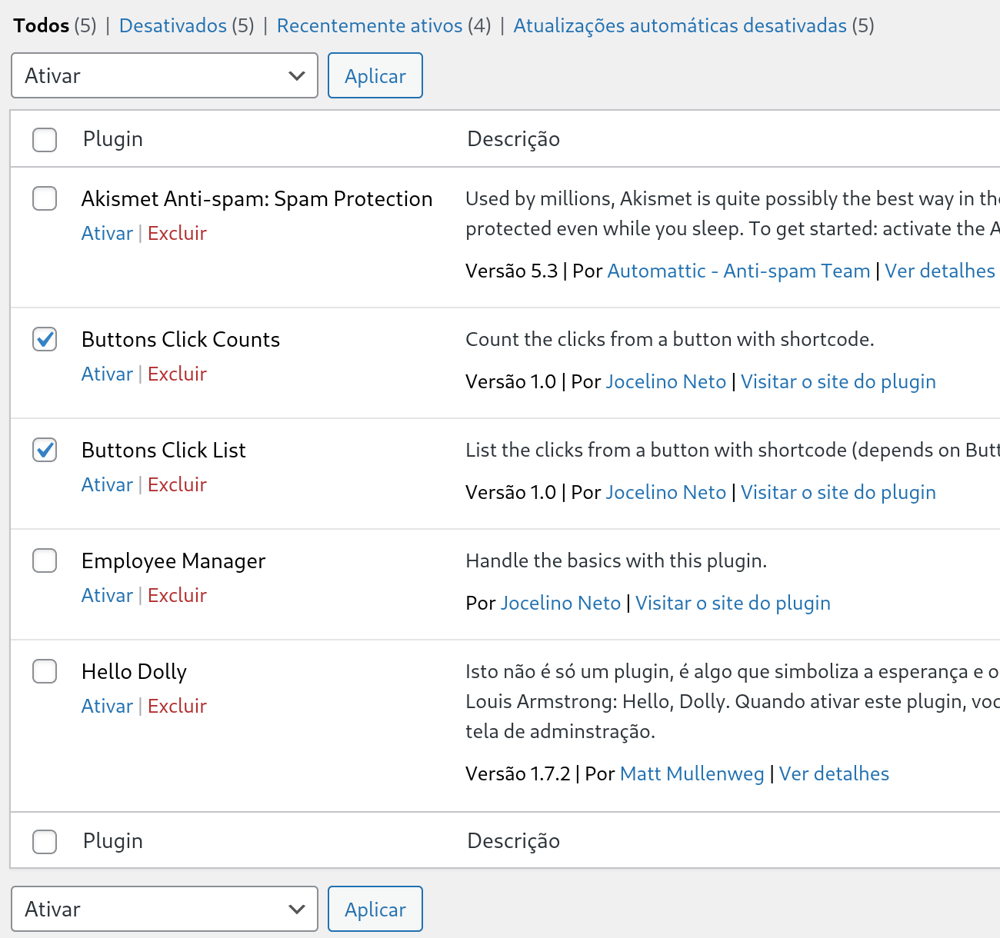
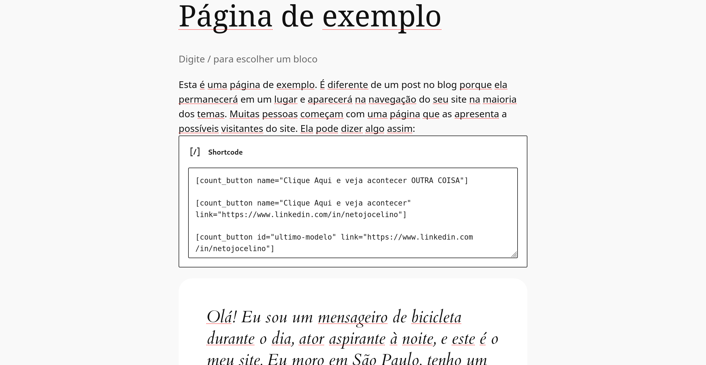
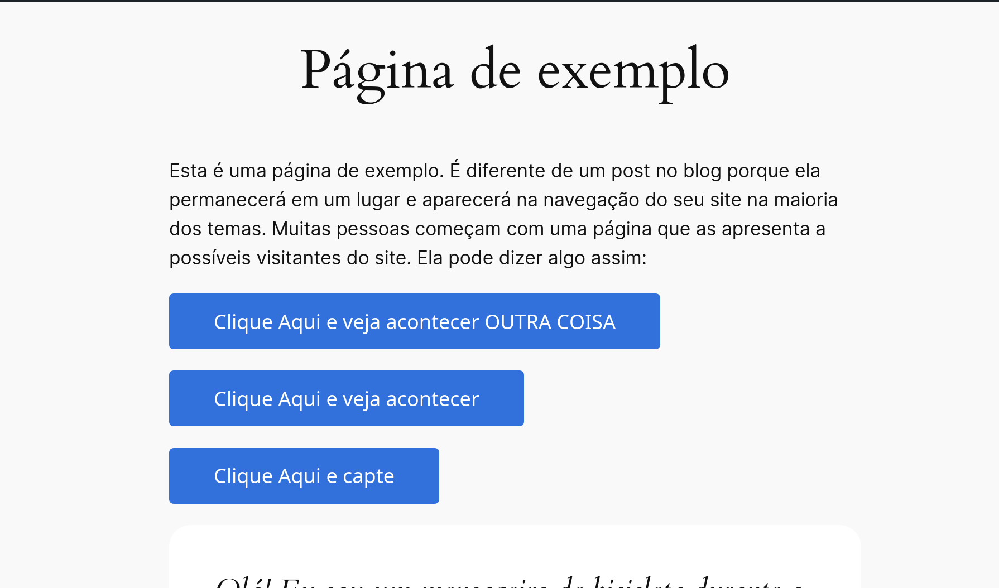
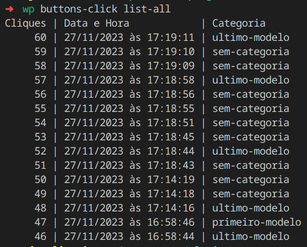
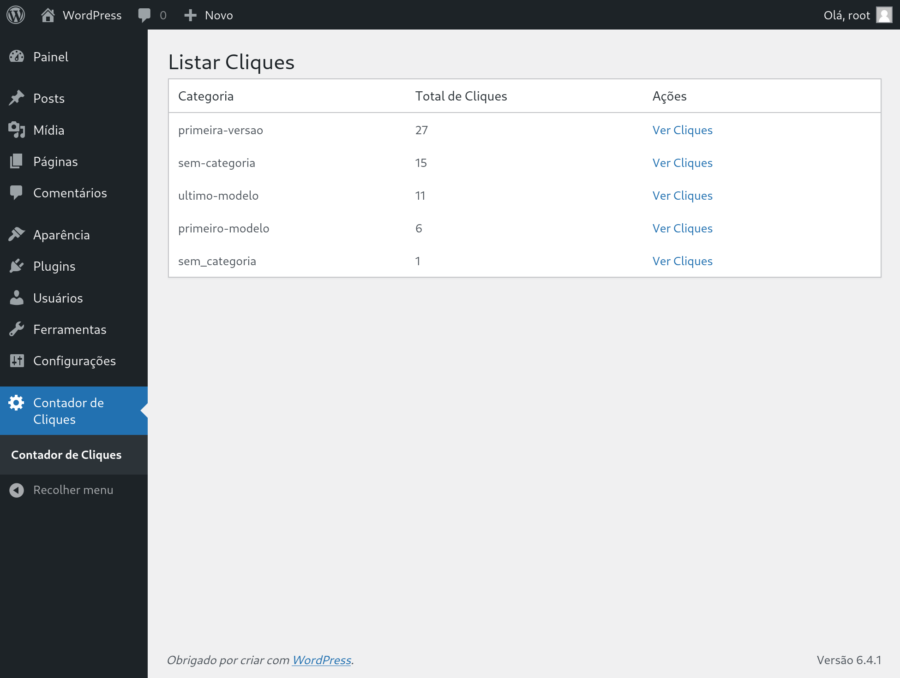

# Clube do Valor - WordPress

[Descrição da tarefa](.github/DESCRIPTION.md) | 

## Como instalar


#### Opção manual

Clone o projeto na pasta de plugins do seu projeto WordPress

```bash
$ git clone https://github.com/netojocelino/clube-do-valor-contagem-botao.git
```

#### Opção com WP-CLI


> ⚠️ **Atenção**
> 
> É necessário ter o [wp-cli instalado](https://wp-cli.org/br/#instalando) para utilizar a linha de comando.


> TODO

## Como ativar

Após realizar a clonagem, ative os plugins na página de plugins instalados, **Buttons Click Counts** para adicionar os `shortcodes` e **Buttons Click List** para exibir os resultados.

<details>
<summary>Print de tela de plugins</summary>

</details>


## Como utilizar

Com o plugin instalado é possível utilizar o `shortcode` `[count_button]`, que pode ser adicionado até 3 (três) atributos.
São eles

 - *id* indica um identificador para catalogar/categorizar tipos de cliques, por padrão tem o valor **sem-categoria**
 - *name* é um valor que irá aparecer dentro do botão, por padrão aparece **Clique Aqui e capte**
 - *link* Valor para abrir uma página em uma nova aba do navegador, por padrão é vazio e não abre nada.

<details>
<summary>Tela com shortcodes adicionados</summary>

</details>

<details>
<summary>Tela botões adicionados</summary>

</details>


## Listar contagens

> ⚠️ **Atenção**
> 
> É necessário ter o [wp-cli instalado](https://wp-cli.org/br/#instalando) para utilizar a linha de comando.

Ao utilizar o *WP-CLI* para listar os resultados, basta utilizar o comando abaixo, que irá listar os últimos 15 cliques, do mais recente ao mais antigo independente da categoria.

```bash
$ wp buttons-click list-all
```


<details>
<summary>Tela de resultados no WP-CLI</summary>

</details>

Também é possível visualizar os resultados abrindo a página administrativa de contagem, **Contador de Cliques**, onde é mostrado as categorias e o total de cliques e dentro o total de cliques e horários.


<details>
<summary>Tela de resultados na web</summary>

</details>
